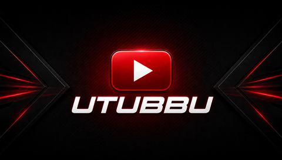

This method puts heavy use on the microSD card, which may shorten its lifespan. Use it at your own risk.


https://github.com/user-attachments/assets/242c4b02-e8a4-40f0-9f93-bc6e107f539f

<p align="center">
  
</p>

<h1 align="center">UTUBBU</h1>

<p align="center">
  YouTube on a 2004 PSP, directly over Wi-Fi.<br>
  No computer, server, account, or API key required.
</p>

<p align="center">
  
  
  
  
</p>

<p align="center">
  <a href="release/UTUBBU-PSP-READY.zip">
    
  </a>
</p>

UTUBBU is an open-source YouTube client designed for PSP homebrew. Search for
videos from the console, browse thumbnails, titles and durations, resolve
streams, and play 360p MP4 AVC/AAC while downloading in the background.

> [!IMPORTANT]
> UTUBBU is an independent, unofficial project. It is not affiliated with,
> sponsored by, or endorsed by YouTube or Google.

## Features

- Search YouTube directly from the PSP
- Results with thumbnails, titles, and durations
- Progressive 360p MP4 AVC/AAC playback
- Pause, resume, and seek forward or backward during playback
- Local cache for replaying downloaded videos
- Interface optimized for the 480 x 272 display
- Standalone connection through the PSP Wi-Fi profile
- No account, personal token, or API key required
- No log files created by the public EBOOT

## How it works

```text
YouTube
   |  HTTPS over Wi-Fi
   v
Search and stream resolution
   |
   +-- Thumbnails -----------------> UTUBBU interface
   |
   `-- MP4 video + audio
              |  progressive download
              v
         Memory Stick cache
              |
              v
        PSP AVC/AAC decoder
              |
              `--------------------> Display + audio
```

Everything runs on the console. No external computer, program, or service is
required.

## Requirements

- A PSP capable of running homebrew
- A Memory Stick with free space
- A Wi-Fi profile already configured in the system settings

## Quick install

1. Download [`UTUBBU-PSP-READY.zip`](release/UTUBBU-PSP-READY.zip).
2. Extract the ZIP archive.
3. Copy the `PSP` folder to the root of the Memory Stick.
4. Launch **UTUBBU** from **Game > Memory Stick**.

Final path:

```text
ms0:/PSP/GAME/UTUBBU/EBOOT.PBP
```

## Controls

| Context | Button | Action |
|---|---:|---|
| Menu | Analog stick / D-pad | Navigate |
| Menu | TRIANGLE | Enter a search query |
| Keyboard | START | Confirm text |
| Menu | X | Open the selected video |
| Player | X | Pause / resume |
| Player | LEFT | Seek backward 10 seconds |
| Player | RIGHT | Seek forward 10 seconds |
| Menu / Player | CIRCLE | Go back / stop |
| Menu | SQUARE | Clear the search |
| Menu | SELECT | Refresh results |

## Privacy

UTUBBU contains no personal credentials and requires no authentication. The
`visitorData` session identifier is obtained at runtime from public responses;
it is not embedded in the source code or EBOOT.

The public build does not create `playback.log`, `playback-prev.log`, or other
diagnostic files.

## Building

The build requires PSPSDK, curl, mbedTLS, the PSP FFmpeg libraries included in
`source/vendor.rar`, and MPEG stubs for firmware 3.71 or later.

Extract `source/vendor.rar` inside `source/` before building. This creates the
`source/vendor/` directory.

```sh
cd source/psp
make
```

With modern libraries and separate shims:

```sh
make PSP_MODERN_LIB="path/to/pspdev" PSP_SHIM_LIB="path/to/shim"
```

The resulting executable is generated at `source/psp/EBOOT.PBP`.

## Project structure

```text
source/     Complete source package, assets and development utilities
  assets/   XMB artwork and fonts
  preview/  Web preview of the interface
  psp/      PSP application source code
  tools/    Development utilities
  vendor.rar Third-party dependencies and source code (extract before building)
release/    Memory Stick-ready binary package
```

## Project status

UTUBBU uses undocumented public endpoints that may change over time. If search
or playback stops working, open an issue and include the PSP model, firmware,
and reproduction steps. Do not publish cookies, signed URLs, or private data.

## Credits and license

UTUBBU is released under the GNU General Public License version 2
(`GPL-2.0-only`). See [`COPYING`](COPYING) and
[`THIRD_PARTY.md`](THIRD_PARTY.md).

The player contains work derived from PMPlayer Advance and OpenTube PSP. The
Roboto font is distributed under the SIL Open Font License 1.1.

---

<p align="center">
  Built to keep the PSP alive.
</p>

<p align="center">
  Built to keep the PSP alive.
</p>
